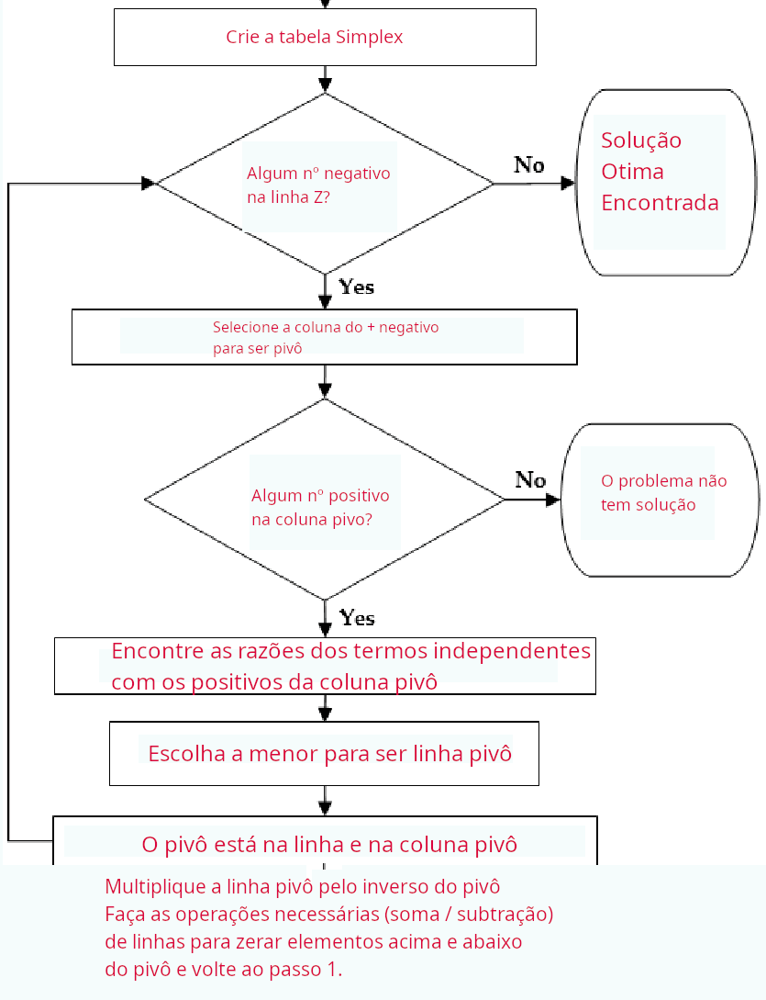

# Pesquisa Operacional II
## Otimização Inteira (Aula 1)

Prof. M.Sc. Diego Ascânio Santos (ascanio@cefetmg.br)

Aula baseada sobre o material do professores Dr. João Fernando Machry Sarubbi (joao@cefetmg.br - DECOM) e Fernando Nogueira.

Belo Horizonte, 2023.

---

Roteiro

1. Definição;
2. Aplicações;
3. Classificação de problemas de Programação Inteira;
4. Resolução do problema das namoradas por meio da força bruta;

---

# Definição

---

Programação Inteira - Definição

<!-- 
A Programação Inteira pode ser entendida como um caso específico da Programação Linear, onde as variáveis devem ser inteiras (ou ao menos, parte destas variáveis).
-->
É um caso específico da programação linear;

<ul>
  <li>Também conhecida como Programação Linear Inteira</li>
  <!-- Pois, -->
  <li>As variáveis devem ser inteiras.</li>
  <ul>
    <li>Algumas</li> <!-- Programação inteira mista -->
    <li>Todas</li> <!-- Programação inteira pura -->
  </ul>
  <li>Porquê?</li>
  <!-- Porquê você não sai com sua namorada 4,44 vezes alguns poderiam dizer -->
  <!-- Mas para resolver isso é muito fácil, basta aplicar o arredondamento. Porém, -->
  <li>O arredondamento funciona em todos os casos?</li>
</ul>

---

Programação Inteira - Arredondamento

Funciona em todos os casos?

---

Programação Inteira - Arredondamento

Funciona em todos os casos?
 
 

DEPENDE

---

Programação Inteira - Arredondamento

Funciona em todos os casos?
 
 

DEPENDE

 
 
Quando o problema envolve grandes magnitudes, o arredondamento não traz grandes impactos.
<ul>
  <li>Produção de carros da GM</li>
  <li>Alocação de passageiros da American Airlines</li>
</ul>

---

Programação Inteira - Arredondamento

Funciona em todos os casos?
 
 

DEPENDE

 
 
Entretanto, a mesma realidade não se reproduz em pequenas magnitudes.
<ul>
  <li>Alocação de funcionários para redes de <i>Fastfood</i> (Subway, Tacobell, etc.);</li>
  <li>Quantidade de saídas com suas namoradas;</li>
  <li>Entre outros</li>
</ul>

---

<h2 style="text-align: center"> Em geral, a regra de arredondar a solução não funciona muito bem, e portanto, não é um procedimento robusto para solucionar problemas de Programação Inteira. </h2>

---

Verificação

Considere:

$$
\begin{equation}
\begin{split}
\text{max}(21x_1 + 11x_2) \\

\text{Sujeito a: } \\

\left\{
    \begin{array}{lr}
        7x_1 + 4x_2 \leq 13\\
        x_1, x_2 \geq 0 \in Z
    \end{array}
\right.

\end{split}
\end{equation}
$$

A solução ótima do problema é:

$$ x_1 = 0, x_2 = 3 $$
<!-- Verificado por meio de força bruta -->

---

    Verificação

<iframe src="http://https://colab.research.google.com/drive/1Q2G-EcMHM5f6xgndqTE0aYh31dAnDH-P?usp=sharing/" width=100% height=100% ></iframe>

---

---

Modelagem de problemas - Introdução

<ul>
  <li>O que é modelo?</li>
  <!-- Um modelo é todo e qualquer tipo de abstração de um problema do mundo real para uma representação matemática capaz de ser solucionada para apresentar os resultados buscados -->
  <li>Porquê programação linear?</li>
  <ul>
    <li>Porquê usa-se de equações/inequações lineares da forma \(ax_1 + bx_2 + cx_3 + \delta  \leq 0\)</li>
  </ul>
  <li> Variáveis de decisão \((x_1, x_2, \cdots, x_n)\) </li>
  <!-- São as variáveis que queremos atribuir valores a elas de forma a maximizar ou minimizar nossa função objetivo -->
  <li> Funções objetivos \(Z = max/min(\alpha x_1 + \beta x_2 + \cdots + \mu x_n )\)</li>
  <!-- As funções que desejamos encontrar os valores máximos e mínimos dadas as restrições -->
  <li> Restrições \( \alpha x_1 + \beta x_2 \leq \Delta \), \( \gamma x_1 + \delta x_2 \geq E \) </li>
  <!-- Funções matemáticas que restringem nosso problema, também obitdas através de modelos, como por exemplo, dinheiro disponível, quantidade de horas, etc., através das quais, garantem que os valores de maximização e minimização sejam não-infinitos -->
</ul>

---

Exemplo - Problema das Namoradas

O professor Diego, um jovem de 29 anos que leciona Pesquisa Operacional II no CEFET-MG tem duas namoradas: Lorena e Grazi. Diego tem disponível R$800,00 por semana para gastar com suas namoradas. Além disto, devido ao seu tempo de Docência ele está disposto gastar no máximo 20 horas por semana com ambas. Com a Lorena, muito custosa, Diego gasta R$180,00 por noite. Já com a Grazi, Diego gasta R$ 100,00 por noite. Além disto, Grazi é mais agitada. Cada saída com ela Diego gasta 4 horas. Quando sai com Lorena, que é mais sossegada, Diego gasta apenas 2 horas.

<ul>
  <li>Quantas vezes por semana Diego deve sair com cada uma delas para maximizar o número de saídas com as namoradas respeitando suas exigências? Sabe-se que ele gosta das duas por igual.</li>
  <li>Resolva o exercício anterior para o caso de Diego gostar duas vezes mais da Lorena.</li>
</ul>

---

Problema das Namoradas - Modelagem

<ul>
  <li>Variáveis de Decisão</li>
  <ul>
    <li>L: Quantas saídas por semana Diego vai efetuar com a Lorena</li>
    <li>G: Quantas saídas por semana Diego vai efetuar com a Grazi</li>
  </ul>
  <li>Função Objetivo:</li>
  <ul>
    <li>\( Z = max(L + G) \)</li>
  </ul>
  <li>Restrições:</li>
  <ul>
    <li>\( 180L + 100G \leq 800 \) (Restrição monetária) </li>
    <li>\( 2L + 4G \leq 20 \) (Restrição de Tempo)</li>
    <li> L, G ∈ R
  </ul>
  <li>Função Objetivo para o caso de Diego gostar duas vezes mais da Lorena: </li>
  <ul>
     <li>\( Z = max(2L + G) \)
  </ul>
</ul>

---

Transformando inequações em equações à partir de variáveis de folga

Sabemos que para aplicar o algoritmo simplex, necessitamos criar variáveis de folga para transformarmos as inequações das restrições em equações lineares, capazes de serem resolvidas com técnicas de resolução de sistemas lineares, usadas pelo próprio simplex. Necessitamos também de padronizar todas as equações para a resolução. Iniciamos o procedimento pelas inequações: 

<ol>
  <li> Para cada restrição \( i \) ∈ Restrições </li>
  <ol>
    <li>Multiplicá-la por \( -1 \) se ela for uma inequação de maior ou igual (\( \geq \)) para transformá-la em menor ou igual (\( \leq \));</li>
    <li>Adicionar uma variável de restrição \( s_i \) no lado esquerdo da equação e trocar \( {} \geq {} \) por \( {} = {} \) </li>
      <ul><li>Exemplo: \( 3x_1 + 4x_3 \leq -4 \rightarrow 3x_1 4x_3 + s_1 = 4 \)</li></ul>
  </ol>
  <li> Para a função objetivo: </li>
  <ol>
    <li>Multiplicá-la por \( -1 \) se ela for de minimização;</li>
    <li>Colocar a função objetivo \( Z \) e todas suas variáveis \( x_j \) do lado esquerdo da equação:</li>
    <ul><li>Exemplo: \( Z - 4x_1 + 8x_2 - 2x_3 = 0 \)</li></ul>
  </ol>
</ol>

---

Montando a matriz Simplex à partir das variáveis de folga;

No problema das namoradas, ao adicionar variáveis de folga às nossas restrições, obtemos:

<ul>
    <li>\( 180L + 100G + S_1 = 800 \) (Restrição monetária) </li>
    <li>\( 2L + 4G + S_2 = 20 \) (Restrição de Tempo)</li>
    <li> \( L, G, S_1, S_2 \) ∈ R </li>
</ul>

Devemos expressar todas as variáveis de decisão, de folga e de objetivo nas nossas equações, para que possamos criar nossa tabela Simplex:

<ul>
    <li>\( 180L + 100G + S_1 + 0S_2 + 0Z = 800 \) (Restrição monetária) </li>
    <li>\( 2L + 4G + 0S_1 + S_2 + 0Z = 20 \) (Restrição de Tempo)</li>
    <li>\( Z - L - G = 0 \) (Função Objetivo)</li>
    <li> \( Z, L, G, S_1, S_2 \) ∈ R</li>
</ul>

---

Matriz Simplex

A partir das equações acima, construímos uma tabela onde as colunas representam respectivamente: as variáveis de decisão, as variáveis de folga, a função objetivo e o termo independente. Nas primeiras linhas colocamos as equações relativas às restrições do problema e na última colocamos a equação de nossa função objetivo.

<table>
  <thead>
    <td>\( L \)</td><td>\( G \)</td><td>\( S_1 \)</td><td>\( S_2 \)</td><td>\( Z \)</td><td>\( \beta \)</td>
  </thead>
  <tr>
    <td>\( 180 \)</td><td>\( 100 \)</td><td>\( 1 \)</td><td>\( 0 \)</td><td>\( 0 \)</td><td>\( 800 \)</td>
  </tr>
  <tr>
    <td>\( 2 \)</td><td>\( 4 \)</td><td>\( 0 \)</td><td>\( 1 \)</td><td>\( 0 \)</td><td>\( 20 \)</td>
  </tr>
  <tr>
    <td>\( -1 \)</td><td>\( -1 \)</td><td>\( 0 \)</td><td>\( 0 \)</td><td>\( 1 \)</td><td>\( 0 \)</td>
  </tr>
</table>

---
# Algoritmo Simplex

---

---
# Resolvendo o problema de programação linear pelo algoritmo Simplex
## No quadro
